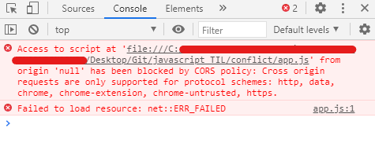
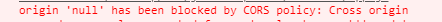

# 무작정 따라하기 1탄

> Interactive Developer - HTML5 Canvas Tutorial : 화면에 튕기는 공 만들기
>
> https://youtu.be/sLCiI6d5vTM

### 배운점

1. window 객체에 대한 학습(브라우저의 요소들과 자바스크립트 엔진, 그리고 모든 변수를 담고 있는 최상위 객체)
   - window.onload = function() 구문
   - window.addEventListener('resize', ...) 구문
   - window.requestAnimationFrame(this.animate.bind(this)) 구문
   - class와 constructor(생성자)
   - canvas에 대한 활용(`getContext('2d')`)

2. `<script>`의 `type`이 module일 경우, cors에러 발생 원인, 이유, 해결방법에 대한 학습

https://developer.mozilla.org/ko/docs/Web/JavaScript/Reference/Classes/constructor

### 발생 이슈

#### CORS(교차 출처 리소스 공유) 관련 에러

- 발단

```html
<!DOCTYPE html>
<html lang="en">
  <head>
    <meta charset="UTF-8">
    <meta http-equiv="X-UA-Conpatible" content="IE=edge, chrome=1"/>
    <meta name="viewport" content="width=device-width, initial-scale=1.0, maximum-scale=1, user-scalable=0">
    <title></title>
    <link rel="stylesheet" type="text/css" href="style.css">
  </head>
  <body>
    <script type="module" src="app.js"></script>
  </body>
</html>
```

위처럼 로컬에서 같이 위치의 파일을 불러왔는데, 갑자기 아래와 같은 에러 메시지가 발생했다.

분명히 같은 폴더의 위치의 로컬파일을 불러왔는데 왜 이런 에러가 발생했을까.. CORS에러 같은 경우에는 서버와 클라이언트간의 출처가 달랐을 경우에 발생하는 것이라고 얼핏 알고있었는데...



- 해결방안

```bash
npm install http-server -g
```

위 키워드로 `http-server`를 전역으로 설치한 다음

```bash
npx http-server
```

위 명령어로 실행시켜 해당 폴더를 서버에 올려 접속하면 해결할 수 있다고 한다.

CORS에러에 대해서는 얼핏 알고 있었지만, 왜 이런 에러가 발생하는지에 대해 설명하지는 못했기에(설명하지 못하면 제대로 아는걸까..?) 구글링을 통해 해답을 얻었다!

- 정답

1. `<script type=module>`의 특성

`type`을 `module`로 설정한 스크립트 태그가 포함된 HTML파일을 로컬에서 로드할 경우 자바스크립트 모듈 보안 요구사항으로 인해 CORS 오류가 발생

2. 로컬의 리소스를 요청할 때의 origin(출처)은 null이다.



코드에서는 c:/경로/index.html에서 c:/경로/app.js으로 같은 경로의 자원을 요청하는데 에러메시지에는 origin, 즉 출처가 null로 넘어온 script에 대한 접근이 CORS정책에 따라 제한되었다고 나와있다.

결과적으로 c:/경로/index.html에서 ajax로 c:/경로/app.js에 리소스를 요청한건 동일 경로의 리소스를 요청한 것이 아니고 c:/경로/index.html에서 null/app.js로 리소스를 요청한 것이 되어 에러가 발생한 것 

- 참고

https://velog.io/@takeknowledge/%EB%A1%9C%EC%BB%AC%EC%97%90%EC%84%9C-CORS-policy-%EA%B4%80%EB%A0%A8-%EC%97%90%EB%9F%AC%EA%B0%80-%EB%B0%9C%EC%83%9D%ED%95%98%EB%8A%94-%EC%9D%B4%EC%9C%A0-3gk4gyhreu

### 할 일

#### http-server에 대해 공부하기

#### 프로젝트 완성